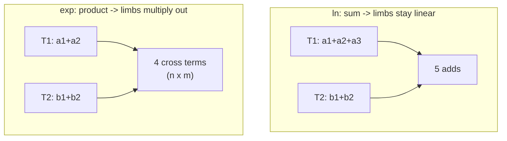

# Plan: bf16 limb tables for `cr_exp_bf16`

> **Superseded — and its central conclusion is wrong.** See
> [EXP-SIN-LIMB-RESULTS.md](EXP-SIN-LIMB-RESULTS.md). `exp` and `sin` both have
> correctly-rounded bf16-only limb tables now, at the same 3x2 configuration
> that solves `ln`.
>
> The error is below, in "Why exp is a different problem": the product does not
> have to be expanded into cross terms. Reconstructing each *factor* from its
> limbs in float32 and then doing the single multiply CORE-MATH already does
> costs `n+m` adds at any limb count. At 3 limbs the reconstruction is exact
> (three bf16 limbs carry float32's 24 significand bits), so the output is
> bit-identical to `cr_exp_bf16`; at 3x2 two entries need a one-ULP nudge.
>
> Task 7's "the coupling rows become bilinear" is right only when *both*
> factors are inexact. Holding `T1` exact makes the entries independent and the
> search collapses to 256 separate enumerations.
>
> The document is kept because the measurement it reports (task 1) and the
> decision gate it proposes (task 3) were the right instincts; only the scheme
> being measured was too narrow.

Companion to the `ln()` limb work (`inria-logbf16-limb.c`). The question is
whether the same trick — store each table entry as a sum of bf16 limbs so the
table needs no float32 — carries over to `exp()`.

**It does not carry over directly.** `exp` reconstructs by a *product*, and
that changes the problem enough that the `ln` result says nothing about it.

## Why exp is a different problem

`cr_log_bf16` ends in a **sum**:

```c
return T1[i1] + T2[i2];              // ln
```

`cr_exp_bf16` ends in a **product** (`implementations/inria-expbf16.c:250`):

```c
return T1[i1] * T2[i2];              // exp
```

A limb split of a sum stays a sum: `(a1+a2+a3) + (b1+b2)` is five terms added.
A limb split of a product *expands*:

```
(a1 + a2)(b1 + b2) = a1b1 + a1b2 + a2b1 + a2b2
```

`n` limbs on one factor and `m` on the other give **n·m cross terms**, not
`n+m`. The 3x2 configuration that solves `ln` with 5 adds becomes 6
multiplies plus 5 adds for `exp`.



## Scoping measurement

An approximate probe over the 3954 inputs that reach the table path
(`0x3b00 < |x| < 0x42ba`), splitting each ideal factor by round-and-subtract
and summing the cross terms exactly:

| Scheme | Cross terms | Wrong roundings |
|---|---|---|
| 1x1 bf16 factors | 1 | 893 |
| 2x2 bf16 limbs | 4 | 7 |
| 3x2 bf16 limbs | 6 | 7 |
| 2x3 bf16 limbs | 6 | 7 |

Two observations, both different from `ln`:

1. **2x2 already gets within 7.** For `ln`, 2x2 left 14 and a third T1 limb
   closed it completely. Here 2x2 is closer to begin with.
2. **A third limb does not help on either factor.** 3x2 and 2x3 both stay at
   7. Whatever blocks those 7 inputs is not the factors' representation
   error, so adding limb precision cannot be the fix.

> These numbers come from reconstructing `x1`/`x2` from the bf16 input rather
> than reading the shipped `T1`/`T2`, so treat them as scoping, not as a
> verdict. Task 1 replaces them with exact per-table measurements.

That (2) is the interesting result: it says the `exp` obstruction is
*structural*, most likely the double rounding inherent in accumulating cross
terms, or the special-case boundaries around `au <= 0x3b00`. Either way it
wants a different remedy than "more limbs".

## Task list

| # | Task | Output |
|---|---|---|
| 1 | Exact per-table probe: read the shipped `T1`/`T2`, split each entry, measure 1x1 / 2x2 / 3x2 / 2x3 over all table-path inputs | `log-research/exp-limb-probe.c` |
| 2 | Diagnose the residual failures — dump each with its ideal, cross-term sum, and distance to the rounding midpoint; classify structural vs representational | probe output |
| 3 | **Decision gate.** If the residuals are representational, continue. If structural, stop and report — no limb count fixes them | — |
| 4 | Limb table generator (mirrors `limb-gen.c`) | `log-research/exp-limb-gen.c` |
| 5 | `cr_exp_bf16_limb` with explicit cross-term accumulation | `implementations/inria-expbf16-limb.c` |
| 6 | Exhaustive MPFR verifier, cross-eval log format | `cross-eval/verify-exp-limb.c` |
| 7 | Per-limb MILP. **Needs new modelling** — the coupling rows become bilinear (`T1_a * T2_b`), which is not an LP. Either linearize over the fixed candidate set or accept a per-entry enumeration | `log-research/milp-exp-limb-gen.cc` |
| 8 | Benchmark vs the float32 baseline | `implementations/benchmark-exp-limb.cpp` |

## Risks

- **Task 7 is the hard one.** `milp-limb-gen.cc` works because `T1_a + T2_b`
  is linear. `T1_a * T2_b` is not, so the `ln` model cannot be copied. The
  honest fallback is exhaustive per-entry enumeration over the candidate
  windows, which is a proof but not an LP.
- **Task 3 may end the project.** If the 7 failures are structural, the
  correct deliverable is a written negative result, not an implementation.
- **Storage still regresses.** `exp`'s `T1` has 512 entries and `T2` 256, so
  2 limbs each costs 2KB against 3KB for float32 — actually a saving here,
  unlike `ln`, because both factors need only 2 limbs. Worth confirming in
  task 1 before promising it.

## Recommendation

Run tasks 1–3 first as a single spike. They are cheap, and task 3 decides
whether the remaining five tasks are worth doing. Do not generate tables or
write the implementation before that gate.
