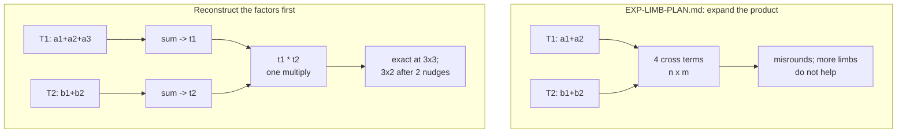

# bf16 limb tables for `cr_exp_bf16` and `cr_sin_bf16`

Result document. Supersedes `EXP-LIMB-PLAN.md`, whose central claim — that the
`ln()` limb trick does not carry over to `exp()` — was wrong, and wrong for an
identifiable reason.

Both functions now have correctly-rounded bf16-only limb tables, verified
exhaustively against MPFR. So does `ln()`, from the earlier work.

The *method* is the same for all three — split every entry into bf16 limbs by
iterated round-and-subtract, rebuild each factor in float32, run the function's
own arithmetic unchanged. The *configuration* is not: it lands wherever each
function's table shapes put it.

| function | reconstruction | minimal config | tuned entries | verified |
|---|---|---|---|---|
| `ln`  | `T1 + T2` | 3×2 | 0 | 0 discrepancies / 65536 |
| `exp` | `T1 * T2` | 3×2 | 2 | 0 discrepancies / 65536 |
| `sin` | `fma(S1, C2, C1*S2)` | 2×3 (mid path) | 0 | 0 discrepancies / 65536 |

`sin` differs because its two index families are different sizes: `S1`/`C1`
hold 256 entries each against `S2`/`C2`'s 128, so the third limb is half the
price on `S2`/`C2`. The mirror arrangement (3×2, matching `ln` and `exp`)
also reaches zero, but costs 512 B more and needs three hand-adjusted index
pairs to get there. Symmetry with the other two functions is not a reason to
pay for it.

## What the plan got wrong

`EXP-LIMB-PLAN.md` reasoned that because `cr_exp_bf16` ends in a product, a
limb split must expand:

```
(a1 + a2)(b1 + b2) = a1b1 + a1b2 + a2b1 + a2b2
```

`n` limbs against `m` giving `n·m` cross terms rather than `n+m` summands. It
measured 7 residual misroundings at 3×2, found that a third limb on either
factor did not help, and concluded the obstruction was structural.

Nothing requires the product to be expanded. Reconstruct each **factor** from
its limbs first, in float32, and then do the single multiply CORE-MATH already
does:

```c
float t1 = l0 + l1 + l2;        /* rebuild the factor */
float t2 = m0 + m1;
return (__bf16) (t1 * t2);      /* one multiply, no cross terms */
```

Cost is `n+m` adds and one multiply at any limb count. The table still holds
nothing but bf16, which is the entire point of the scheme.



The plan's 7 was also measured against factors reconstructed from the bf16
input rather than against the shipped `T1`/`T2` — it says so itself, and calls
the numbers scoping rather than a verdict. Measured against the shipped tables
the figure is 2, and both are hard-to-round cases sitting ~3e-5 of an ULP above
a bf16 rounding midpoint.

## Why 3 limbs is exact

A bf16 carries 8 significand bits; float32 carries 24. Three non-overlapping
bf16 limbs therefore represent **any** float32 exactly, so the reconstructed
factor is bit-for-bit the shipped value and the output is identical to
CORE-MATH on every input. This is a fact about significand widths, not a test
result — the exhaustive check confirms it rather than establishing it.

Two caveats, both in `exp`'s `T1` and both handled by the generator:

- `T1[247..255]` hold `FLT_MAX`, the overflow cap. bf16 has no such value; it
  rounds to `+Inf`, so the residual `FLT_MAX - Inf` is `-Inf` and would poison
  every later limb with NaN. The split stops on a non-finite residual, leaving
  `{+Inf, 0, 0}` — whose product with any `T2` is `+Inf`, which is what the
  shipped table produces there.
- `T1[500..505]` sit at or below bf16's `2^-133` subnormal floor and cannot
  split exactly at any limb count. The 28 inputs reaching them underflow to
  bf16 zero regardless, which the exhaustive check confirms.

`sin`'s six tables are all in `[-1, 1]` with no entry smaller than `0x1.22p-8`,
so neither caveat has an analogue there.

## Why 3×2 works: exactness on one side decouples the search

At 3×2 the second factor is genuinely lossy (~3e-6 relative), so correctness is
a real question rather than a corollary. It is answerable because the **first**
factor stays exact.

`EXP-LIMB-PLAN.md` task 7 correctly observed that a per-limb MILP for `exp` has
bilinear coupling rows (`T1_a * T2_b`), which is not an LP. That is true only
when both factors are inexact. Holding `T1` exact confines all residual error
to one side of the product, and the model collapses into 256 independent
single-entry searches — each `T2` entry can be chosen without reference to any
other. Enumerating a ±12 ULP window per entry is then a complete search, and a
cheap one.

The answer: 254 of 256 entries work at the canonical round-and-subtract split,
and `T2[91]` and `T2[182]` each need their second limb moved by one ULP. This
is the same manual adjustment CORE-MATH's own `.sage` generators apply (see
`report.md` §6f), applied per limb instead of per entry.

`sin`'s mid path is the same argument anchored on the other factor: `S2`/`C2`
stay exact at three limbs and `S1`/`C1` drop to two, so the search decouples
across `i1`. One wrinkle either way — `S1[i1]` and `C1[i1]` both feed a single
`fma`, so they are chosen jointly, a 2-D search per index but still independent
across indices. At the shipped 2×3 the canonical split already serves every
input and **nothing is tuned**; the generator keeps the search anyway, so that
"two limbs suffice" stays a checked property rather than an assumption.

The mirror (3×2, `S1`/`C1` exact) needs three adjusted pairs — `i2` = 89, 98
and 123. It is reported by `limb-config-sweep` to show the repair works from
either side of the product, but it is not what ships.

## Where it does not work: `sin`'s large path

For `|x| >= 4096` the implementation runs an angle-addition chain over `S3`/`C3`,
up to eight lookup pairs per input, and every entry is reused across many
inputs. The errors compound and the decoupling argument fails — there is no
"exact factor" to hold fixed, because each step's output is the next step's
input.

`limb-config-sweep` measures it. Two limbs misround 70 inputs; a bounded greedy
coordinate descent over the per-entry displacements repairs 62 of them and then
stalls at 8, with further passes finding no improvement. Coordinate descent is
not exhaustive, so this is evidence that two limbs do not suffice on that path
rather than a proof — ruling it out would need a joint search over the whole
chain. `S3`/`C3` therefore keep three limbs in both shipped variants, where
they are exact and the question does not arise.

This is the honest negative result of the exercise, and it is the *only* place
across the three functions where the trick does not reduce storage.

## Measured frontier

From `make limb-sweep`. Mismatches are against the shipped float32
implementations, which are correctly rounded on every bfloat16 input — so these
are wrong roundings, not merely differences.

```
exp: T1 x T2 limbs                sin mid: S1/C1 x S2/C2         sin large: S3/C3
  (3954 table-path inputs)          (3886 mid-path inputs)
  1x1  886    2x1  664   3x1 656    1x1 1204   2x1 820  3x1 818     1 limb  15076
  1x2  722    2x2    3   3x2   2    1x2 1026   2x2   4  3x2   6     2 limbs    70
  1x3  722    2x3    3   3x3   0    1x3 1026   2x3   0  3x3   0     3 limbs     0
                              ^exact                 ^shipped                 ^exact
with per-entry tuning:  3x2 -> 0 (2 entries)   3x2 -> 0 (3 pairs)   2 -> 8 (greedy floor)
```

Two cells reach zero on `sin`'s mid path. 2×3 is shipped: 5060 B against 3×2's
5572 B, and no tuned entries against three.

## Storage and cost

Storage is a regression in every case, as it was for `ln`. The scheme targets
hardware with bf16 storage or bf16 MACs and no float32 table path; it is not a
space optimisation.

| function | float32 | exact | minimal |
|---|---|---|---|
| `exp` | 3072 B | 4608 B (+50%) | 4096 B (+33%) |
| `sin` | 4056 B | 6084 B (+50%) | 5060 B (+25%) |

Throughput, from `make bench` on an Apple M-series (best of 3 runs per
measurement; ratios against the float32 tables, lower is better):

| function | path | exact | minimal |
|---|---|---|---|
| `exp` | table path | 1.31–1.37× | 1.24–1.30× |
| `sin` | mid path | ~1.86× | ~1.70× |
| `sin` | large path | ~1.14× | ~1.12× |

`exp` is the cheapest of the three — one multiply, and the limb sums pipeline
alongside it — against roughly 2.2× for the `ln` limb tables. `sin`'s mid path
is the most expensive per lookup because it reconstructs four factors per call;
its large path is *relatively* cheap only because the chain's arithmetic
already dominates.

Both benchmarks include a no-table control cluster. Its variants execute
identical code, so its ratio measures the harness noise floor rather than any
cost of the scheme — a single timed run swung it between 0.54× and 1.06×,
which is why the harness reports the best of three.

## Files

| File | Role |
|---|---|
| `exp-limb-gen.c` | emits `implementations/expbf16-limb.h` (3×3 and 3×2) |
| `sin-limb-gen.c` | emits `implementations/sin/sinbf16-limb.h` (exact and minimal) |
| `limb-config-sweep.c` | the frontier above, plus both repair searches |
| `../implementations/inria-expbf16-limb.c` | `cr_exp_bf16_limb`, `cr_exp_bf16_limb_min` |
| `../implementations/sin/inria-sinbf16-limb.c` | `cr_sin_bf16_limb`, `cr_sin_bf16_limb_min` |
| `../cross-eval/verify-limb.c` | exhaustive MPFR check, both functions, both variants |
| `../implementations/benchmark-exp-limb.cpp` | throughput vs the float32 tables |
| `../implementations/benchmark-sin-limb.cpp` | throughput vs the float32 tables |

```
make limb-tables   # regenerate every bf16 limb table (ln, exp, sin)
make limb-sweep    # reproduce the frontier
make verify        # exhaustive MPFR check, including the limb tables
make bench         # throughput
```

## What is not done

- **No MILP for `exp` or `sin`.** With the first factor exact the feasibility
  question is 256 (resp. 128) independent finite enumerations, which
  `limb-config-sweep` performs completely. An LP would restate a search that is
  already exhaustive. The bilinear model `EXP-LIMB-PLAN.md` task 7 describes is
  only needed if both factors are inexact — that is, for 2×2, which is not a
  configuration either function needs.
- **`sin`'s large path at two limbs is open**, per the section above.
- **No `cr_cos_bf16`.** `cr_sin_bf16` uses the cosine tables and computes a
  cosine internally on the large path, so `C1`/`C2`/`C3` are covered, but the
  repository exposes no cosine entry point to give a limb variant of.
