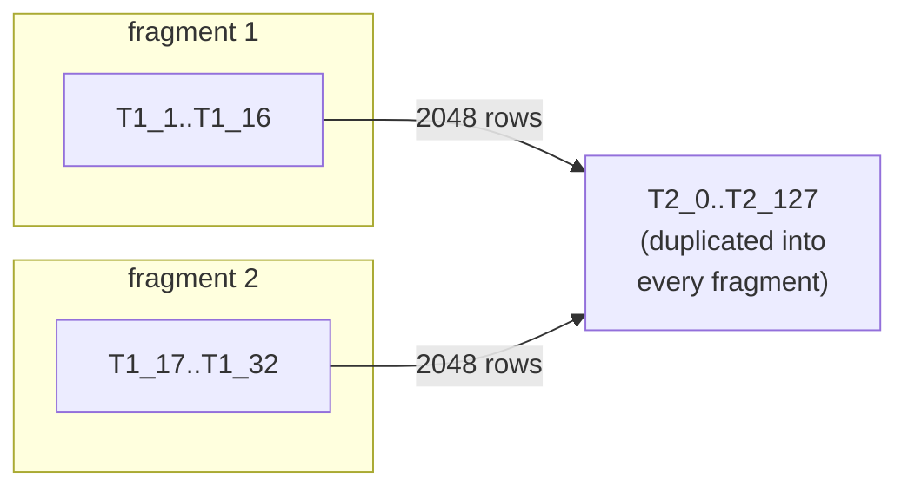

# log-research

Does a correctly-rounded `ln()` for bfloat16 exist using a two-table
(`T1`, `T2`) reconstruction, where both tables are themselves bf16 values?

The question is posed as a MILP: if the model is **feasible**, such a table
pair exists. If it is **infeasible**, no bf16-grid table can be correctly
rounded at that candidate width — a property of the format, not of any
particular implementation.

## Pipeline

```bash
./build-lp.sh          # generate milp-constraints.lp + fragments
./solve-fragments.sh   # solve each fragment, print status table
```

`build-lp.sh` drives three CMake targets from the repo root (`bound-calc` and
`milp-gen` hardcode `log-research/`-prefixed output paths):

| Step | Target | Output |
|---|---|---|
| 1 | `ln-precompute` | `ln-precompute.txt` — `ln(x)` for every bf16 input |
| 2 | `ln-bounds` | `ln-bounds.txt`, `lp-constraints.txt` |
| 3 | `ln-milp` | `milp-constraints.lp` — the MILP |

It then splits the model and checks that no coupling rows were lost.

## Model structure

254 `T1` entries, 128 `T2` entries. Each is pinned to one of `2*CAND_ULP+1`
bf16 candidates by a `selT*` (choose exactly one) and `linkT*` (bind the
continuous value to the chosen candidate) row pair.

Every coupling row has the exact form:

```
c<N>_lo: T1_a + T2_b >= <bound>
c<N>_hi: T1_a + T2_b <= <bound>
```

254 × 128 × 2 = **65024 coupling rows**. There is no T1–T1 or T2–T2 coupling,
which is what makes the model decomposable.



## Why fragment at all

The full model makes `glpsol` hang. Each fragment solves in well under a
second. A fragment keeps a subset of `T1` plus **all** of `T2`, so it is a
valid standalone LP.

### Reading the results — the logic is asymmetric

| Result | Means |
|---|---|
| Any fragment **INFEASIBLE** | Full model **INFEASIBLE**, proven. Fragment rows are a subset, so infeasibility lifts. |
| All fragments **OPTIMAL** | **Nothing.** Each fragment picks its own `T2`; they need not agree. Feasibility does not compose. |

## Fragment modes

```bash
./build-lp.sh                      # 16 T1 chunks (default)
./build-lp.sh --blocks 32
./build-lp.sh --t2-blocks 16       # slice T2 instead, to localize a conflict
./build-lp.sh --t1-range 1 8       # one partial fragment
python3 split-milp.py --pin-t2 fragments/solutions/frag-t1-001-016.sol
```

`--pin-t2` freezes every `zT2_k_j` to a solved fragment's assignment, which
makes the `T1` blocks genuinely independent. Infeasible blocks then name
exactly which `T1` entries that `T2` cannot serve.

## Do not trust a bare `Optimal`

The coupling bounds sit **~1e-9 apart** (`-87.749999998999996` vs
`-87.250000001000004`), tighter than GLPK's default primal and integer
tolerances. `glpsol` will report `OPTIMAL` on assignments that violate the
source rows by up to ~1e-3.

```bash
python3 check-solution.py fragments/solutions/fragpin-t1-*.sol
```

`check-solution.py` recomputes every coupling row in exact decimal arithmetic.
It reads values from the `zT*_k_j` binaries and the LP's literal `link`
coefficients — never the `.sol` Activity column, which prints only ~6
significant digits, an error ~65x the tolerance being tested.

This is not hypothetical. Pinning a `T2` taken from one solved block at
`CAND_ULP=6` produced `OPTIMAL` on all 16 `T1` blocks, yet 97 genuine
violations (worst slack -7.7e-4), with one landing at exactly -1.0e-9.

## Current status

At the current `CAND_ULP=3` (see `milp-gen.cc:42`), **every fragment is
INFEASIBLE**, detected at the LP relaxation before branching — so this verdict
is not tolerance-sensitive. Infeasibility composes upward, so the full model is
infeasible: no bf16-grid `T1`/`T2` pair reproduces a correctly-rounded `ln()`
within ±3 ULP candidate windows.

Widening `CAND_ULP` enlarges the candidate sets and is the lever to test next.

## Files

| File | Role |
|---|---|
| `precompute.c`, `bound-calc.c`, `milp-gen.cc` | pipeline stages 1–3 |
| `build-lp.sh` | build + split, with a row-conservation check |
| `split-milp.py` | decomposition (`--blocks`, `--t2-blocks`, `--t1-range`, `--pin-t2`) |
| `solve-fragments.sh` | run `glpsol` per fragment; nonzero exit if any is not OPTIMAL |
| `check-solution.py` | exact re-validation of a composed assignment |

`fragments/` and all `.lp` files are gitignored — regenerate with `build-lp.sh`.

`core-near1.lp`, `core-i1_126.lp`, `core-i1_127.lp` and
`milp-constraints-min.lp` are kept artifacts with **no generator in this repo**;
nothing here rebuilds or overwrites them.
