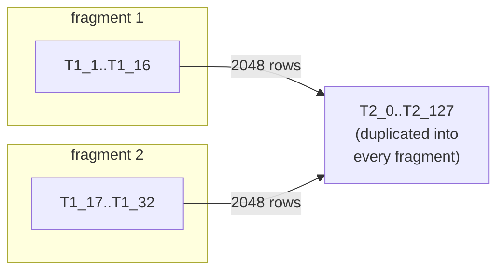

# log-research

Does a correctly-rounded `ln()` for bfloat16 exist using CORE-MATH's table
layout — `T1 + T2` for normal inputs, a direct `T3` lookup for subnormals —
where every table entry is itself a bf16 value?

The question is posed as a MILP: if the model is **feasible**, such a table set
exists. If it is **infeasible**, no bf16-grid table can be correctly rounded at
that candidate width — a property of the format, not of any particular
implementation.

## Pipeline

```bash
./build-lp.sh          # generate milp-constraints.lp + fragments
./solve-fragments.sh   # solve each fragment, print status table
```

`build-lp.sh` drives three CMake targets from the repo root (`bound-calc` and
`milp-gen` hardcode `log-research/`-prefixed output paths):

| Step | Target | Output |
|---|---|---|
| 1 | `ln-precompute` | `ln-precompute.txt` — `ln(x)` for every bf16 input |
| 2 | `ln-bounds` | `ln-bounds.txt`, `lp-constraints.txt` |
| 3 | `ln-milp` | `milp-constraints.lp` — the MILP |

It then splits the model and checks that no coupling rows were lost.

## Model structure

254 `T1` entries, 128 `T2` entries, 127 `T3` entries. Each is pinned to one of
`2*CAND_ULP+1` bf16 candidates by a `selT*` (choose exactly one) and `linkT*`
(bind the continuous value to the chosen candidate) row pair.

Every coupling row has the exact form:

```
c<N>_lo: T1_a + T2_b >= <bound>
c<N>_hi: T1_a + T2_b <= <bound>
```

254 × 128 × 2 = **65024 coupling rows**. There is no T1–T1 or T2–T2 coupling,
which is what makes the model decomposable.

### T3 is a lookup, not a summand

`cr_log_bf16` returns `T3[i2]` **outright** when `i1 == 0` — it does not add a
third term. For subnormal `x` the split `x = 2^(i1-127) * (1 + i2/128)` breaks
down (no implicit leading 1), so the subnormal band gets its own direct table.
Each of the 127 subnormal inputs (`u == i2`, `i2 = 1..127`) therefore
contributes a **single-variable** row pair:

```
s<u>_lo: T3_k >= <bound>
s<u>_hi: T3_k <= <bound>
```

127 × 2 = **254 subnormal rows**. `T3[0]` (`x = +0`, `ln = -Inf`) is exact and
carries no rounding interval, so it is left out of the model entirely — matching
CORE-MATH's hardcoded `-Inf`.

The consequence is that `T3` is independent of `T1`, of `T2`, and of the rest of
`T3`. Its 127 entries are 127 separate one-variable feasibility questions, which
is why it needs no decomposition and why its `OPTIMAL` means what it says.



## Why fragment at all

The full model makes `glpsol` hang. Each fragment solves in well under a
second. A fragment keeps a subset of `T1` plus **all** of `T2`, so it is a
valid standalone LP.

### Reading the results — the logic is asymmetric

| Result | Means |
|---|---|
| Any fragment **INFEASIBLE** | Full model **INFEASIBLE**, proven. Fragment rows are a subset, so infeasibility lifts. |
| All `T1` fragments **OPTIMAL** | **Nothing.** Each fragment picks its own `T2`; they need not agree. Feasibility does not compose. |
| `frag-t3-only` **OPTIMAL** | `T3` is **solved**. Its rows are single-variable, so there is no shared value to disagree about and nothing to compose. |

## Fragment modes

```bash
./build-lp.sh                      # 16 T1 chunks (default)
./build-lp.sh --blocks 32
./build-lp.sh --t2-blocks 16       # slice T2 instead, to localize a conflict
./build-lp.sh --t1-range 1 8       # one partial fragment
python3 split-milp.py --pin-t2 fragments/solutions/frag-t1-001-016.sol
```

`--pin-t2` freezes every `zT2_k_j` to a solved fragment's assignment, which
makes the `T1` blocks genuinely independent. Infeasible blocks then name
exactly which `T1` entries that `T2` cannot serve.

## Do not trust a bare `Optimal`

The coupling bounds sit **~1e-9 apart** (`-87.749999998999996` vs
`-87.250000001000004`), tighter than GLPK's default primal and integer
tolerances. `glpsol` will report `OPTIMAL` on assignments that violate the
source rows by up to ~1e-3.

```bash
python3 check-solution.py fragments/solutions/fragpin-t1-*.sol
```

`check-solution.py` recomputes every coupling row in exact decimal arithmetic.
It reads values from the `zT*_k_j` binaries and the LP's literal `link`
coefficients — never the `.sol` Activity column, which prints only ~6
significant digits, an error ~65x the tolerance being tested.

This is not hypothetical. Pinning a `T2` taken from one solved block at
`CAND_ULP=6` produced `OPTIMAL` on all 16 `T1` blocks, yet 97 genuine
violations (worst slack -7.7e-4), with one landing at exactly -1.0e-9.

## T2 precision sweep

`t2-precision-sweep.c` asks the natural follow-up: if `T2` were *stored wider
than bf16* — `T1` still bf16, the correctness target still bf16 rounding — how
many significand bits does `T2` need?

```bash
cmake --build build --target t2-precision-sweep
./log-research/t2-precision-sweep               # widths 8..24
./log-research/t2-precision-sweep --min-bits 8 --max-bits 32 --keep
```

It drives the existing pipeline once per width (`milp-gen p FILE` →
`split-milp.py` → `glpsol` → `check-solution.py`) and accepts a width only when
**every fragment is OPTIMAL *and* the exact re-check is clean** — never on a
bare `Optimal`, for the reason in the section above.

The search runs linearly upward rather than bisecting: feasibility is not known
to be monotone in `p`. A finer `T2` grid moves every candidate, so a width that
fails says nothing rigorous about a narrower one.

`milp-gen` takes `[T2_PREC [OUT_FILE [T1_PREC [T3_PREC]]]]`. At the defaults it
emits the bf16-grid model; only `T2`'s candidate grid changes above that. `T1`,
`T3` and the coupling bounds are identical at every width.

### Result: T2 width is not the binding constraint

Every width from 8 to 24 bits is **INFEASIBLE**, all at the LP relaxation:

| T2 bits | Result |
|---|---|
| 8 … 24 | INFEASIBLE (16/16 T1 fragments, LP relaxation) |

This is not a limit of the sweep range. With `T2` given *unlimited* precision
and `T1` free to take any of its 7 candidates, 95 of the 128 `T2` indices still
have an **empty** feasible interval — no real number, at any storage width,
satisfies their rows.

The constraint is `CAND_ULP`, which confines `T1` to ±3 bf16 ULPs of its ideal.
Widening `T2` cannot rescue a row that `T1`'s own window already excludes.

## T1 precision sweep

The mirror experiment: pin `T2` and widen `T1` instead.

> The `n/17` counts in the two tables below predate `T3`. The sweeps count every
> fragment in `fragments/`, so they now report `n+1` out of **18** — the extra
> one is `frag-t3-only`, which is always OPTIMAL and never the deciding
> fragment. The verdicts are unchanged.

```bash
cmake --build build --target t1-precision-sweep
./log-research/t1-precision-sweep                          # T2 pinned at 10
./log-research/t1-precision-sweep --t2-bits 16 --tmlim 120
```

`milp-gen` takes `[T2_PREC [OUT_FILE [T1_PREC [T3_PREC]]]]`; `T1_PREC` and
`T3_PREC` come last so existing two- and three-argument calls keep working. All
default to 8. `T3_PREC` is present for symmetry only — `T3` already solves at 8
bits, so there is nothing to sweep.

### With T2 pinned at 10 bits: blocked by one index

| T1 bits | Result |
|---|---|
| 8 … 12 | INFEASIBLE (1/17 fragments optimal) |
| 13 … 15 | INFEASIBLE (2–15/17) |
| 16 … 24 | INFEASIBLE (**16/17** — one fragment holds out) |

Unlike the T2 sweep, this one makes real progress: fragments flip to OPTIMAL as
`T1` widens, and from 16 bits up exactly **one** fragment remains infeasible.
At `T1 >= 16` the LP relaxation is feasible and only the *integer* problem
fails — a qualitative change from the T2 sweep, where every width died at the
relaxation.

Bisecting that fragment isolates the obstruction to a single entry, **`T1_126`**
— exponent −1, the binade `x` in `[0.5, 1)`. It is infeasible *on its own*, with
all 128 `T2` entries free to help. Testing all 254 indices individually at
`T1=20, T2=10`, it is the **only** singleton-infeasible one.

That obstruction is `T2`-driven, not `T1`-driven. Holding `T1` at a generous 24
bits and varying `T2`:

| T2 bits | `T1_126` alone |
|---|---|
| 10, 12 | INFEASIBLE |
| 16, 20, 24 | OPTIMAL |

So `T2 = 10` is what caps this sweep. `T2` needs ~16 bits before the near-1
binade can be served at all.

### With T2 pinned at 16 bits: OPTIMAL, but not correct

| T1 bits | Result |
|---|---|
| 8 … 14 | INFEASIBLE (1/17) |
| 15 | INFEASIBLE (7/17) |
| 16 | INFEASIBLE (16/17) |
| 17 … 24 | **VIOLATED** — 17/17 optimal, exact re-check fails |

This is the trap the section above warns about, caught automatically. From 17
bits every fragment reports `INTEGER OPTIMAL`; a sweep trusting bare status
would report **17 bits** as the answer. `check-solution.py` rejects it — the
composed assignment violates real coupling rows by 1e-5 to 9e-5, four orders of
magnitude past the 1e-9 tolerance:

```
VIOLATION c13797_hi: T1_107 + T2_101 <= -13.281250001
                     -> -13.281158447265625  (slack -9.155e-5)
```

`glpsol` accepts these because they fall inside its default integer tolerance.
They are genuine violations of the source model, not composition artifacts.

**No `T1` width in 8..24 yields a correct table at either pinned `T2`.**

## T3 result: solved at 8 bits

`T3` is **feasible on the bf16 grid**, and unlike the `T1`/`T2` fragments this
is a real answer rather than a non-result:

| Fragment | Status | Exact re-check |
|---|---|---|
| `frag-t3-only` | OPTIMAL | 254/254 rows clean, worst slack 0 |

Every one of the 127 subnormal inputs has an 8-bit grid value inside its
rounding interval, within ±3 ULP of its ideal. `check-solution.py` re-validates
all 254 rows in exact decimal arithmetic and finds zero violations — so this is
not a bare `Optimal` of the kind the section above warns about. It could not be:
single-variable rows have no composition step to go wrong.

### The solved table is narrower than CORE-MATH's

CORE-MATH stores `T3` as `b32u32_u` — **float32**, not bf16. Its entries carry
more significand than bf16 has (`T3[1] = -0x1.70c2p+6 = -92.189453125`), and 126
of the 127 differ from the solved 8-bit values.

Both are correct. Checked against `round_bf16(ln(k * 2^-133))` for all 127
indices:

| Table | Wrong bf16 roundings |
|---|---|
| solved 8-bit `T3` | 0 / 127 |
| CORE-MATH float32 `T3` | 0 / 127 |

So the extra float32 width in CORE-MATH's `T3` is not needed for bf16 correct
rounding — an 8-bit `T3` suffices, halving that table's storage. This is the
opposite of the `T1`/`T2` finding, where 8 bits is not enough and even 24 is not.

## Current status

At the current `CAND_ULP=3` (see `milp-gen.cc:64`), **every `T1` fragment is
INFEASIBLE**, detected at the LP relaxation before branching — so this verdict
is not tolerance-sensitive. Infeasibility composes upward, so the full model is
infeasible: no bf16-grid `T1`/`T2` pair reproduces a correctly-rounded `ln()`
within ±3 ULP candidate windows.

Adding `T3` does not change that verdict and was never going to: `T3` shares no
variable with `T1` or `T2`, so it can neither rescue nor worsen them. What it
adds is that the subnormal band — previously outside the model entirely, marked
`NON-LP` by `bound-calc` — is now proven solvable at bf16 width. The obstruction
is confined to the `T1 + T2` reconstruction for normal inputs.

Note the continuous relaxation (`lp-constraints.txt`, both tables free reals) is
**OPTIMAL**. A real-valued solution exists; it is the grid plus the ±3 ULP
window that destroys it. Since the sweep above rules out `T2` width as the
lever, widening `CAND_ULP` is what remains to test.

## bf16 limb tables — a positive result for T1/T2

The MILP above asks whether ONE bf16 grid value per entry can serve every
input. It cannot: every `T1` fragment is infeasible. The weaker question --
can each entry be a SUM of bf16 limbs? -- is feasible, and the tables are
generated and shipped.

`limb-gen.c` emits `implementations/log/logbf16-limb.h`: 3 bf16 limbs per `T1`
entry, 2 per `T2`, 1 per `T3`. `inria-logbf16-limb.c` sums them in float32 and
rounds once. `cross-eval/log/verify-limb.c` checks all 65536 bf16 inputs
against MPFR and reports **0 discrepancies**.

`milp-limb-gen.cc` emits the corresponding per-limb MILP, and
`check-limb-solution.py` re-validates the emitted tables against all 65278
rows in exact decimal arithmetic -- 0 violations, worst slack 0. That exact
re-check, not any `glpsol` status, is what makes the feasibility claim safe:
the rows are ~1e-9 wide, so a bare `Optimal` means nothing here, exactly as
the section above warns.

Storage is a regression, not a saving: 48 bits per `T1` entry against 32 for
CORE-MATH's float32, +12.5% overall (`T3` halves, `T1` grows). The scheme is
for targets with bf16 storage or bf16 MACs and no float32 table path. On the
benchmark it runs ~2.2x slower than the float32 tables for normals and ~0.6x
(faster) for subnormals, where it reads one bf16 instead of one float32.

See `EXP-LIMB-PLAN.md` for whether the same trick can work for `exp()`; the
short answer is that `exp` reconstructs by a product, so limbs multiply out
into n*m cross terms rather than n+m summands.

## Files

| File | Role |
|---|---|
| `precompute.c`, `bound-calc.c`, `milp-gen.cc` | pipeline stages 1–3 |
| `frag-t3-only.lp` | the whole `T3` subproblem, emitted unsliced |
| `t2-precision-sweep.c` | sweeps T2 significand width over the whole pipeline |
| `build-lp.sh` | build + split, with a row-conservation check |
| `split-milp.py` | decomposition (`--blocks`, `--t2-blocks`, `--t1-range`, `--pin-t2`) |
| `solve-fragments.sh` | run `glpsol` per fragment; nonzero exit if any is not OPTIMAL |
| `check-solution.py` | exact re-validation of a composed assignment |

`fragments/` and all `.lp` files are gitignored — regenerate with `build-lp.sh`.

`core-near1.lp`, `core-i1_126.lp`, `core-i1_127.lp` and
`milp-constraints-min.lp` are kept artifacts with **no generator in this repo**;
nothing here rebuilds or overwrites them.
